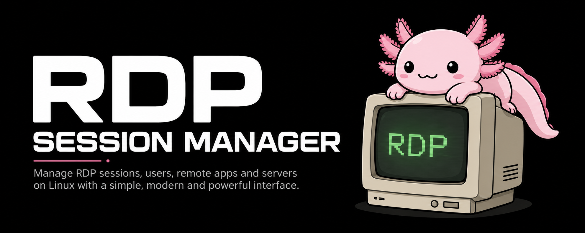

<div align="center">
  <h1>RDP Session Manager</h1>
  <br>
  
  <br><br>
  <a href="https://github.com/Pedroltz/rdp-session-manager/blob/master/LICENSE"></a>
  <a href="https://www.python.org/"></a>
  <a href="https://www.gtk.org/"></a>
  <a href="https://github.com/Pedroltz/rdp-session-manager/releases"></a>
  <br><br>
  <p><code>Linux</code> &nbsp;•&nbsp; <code>GTK 4</code> &nbsp;•&nbsp; <code>libadwaita</code> &nbsp;•&nbsp; <code>xrdp</code> &nbsp;•&nbsp; <code>RemoteApp</code></p>
</div>

## Overview

RDP Session Manager provides a graphical interface for administering RDP access through xrdp on supported Linux distributions. It centralizes account management, session configuration, and dependency checks in a native GTK 4 and libadwaita application.

## Features

- Create, remove, enable, and disable RDP user accounts.
- Configure full desktop sessions with KDE Plasma, GNOME, or XFCE.
- Run Linux applications as RemoteApp sessions.
- Run Windows applications through umu, with legacy WineGE prefix compatibility.
- Check and install required RDP components when needed.
- Monitor user status and active sessions.
- Inspect unified host, user, and session health from GTK or `rdpsm health`.
- Preview repair plans, automatically roll back managed files on failure, and
  export privileged repair audit events as JSONL.

## Technology

- Python 3.9+
- GTK 4 and libadwaita
- xrdp and FreeRDP
- PolicyKit for privileged system operations

## Requirements

Supported distributions:

- Ubuntu 22.04 LTS or later and derivatives
- Debian 12 or later
- Arch Linux and derivatives, including Manjaro, EndeavourOS, and CachyOS

The application requires Python, GTK 4, libadwaita, and PolicyKit. The installer can set up xrdp and FreeRDP; see the installation guide for the complete dependency list.

## Installation

Run the official installer:

```bash
curl -fsSL https://github.com/Pedroltz/rdp-session-manager/releases/latest/download/install.sh | bash
```

For manual installation, installer options, and platform-specific notes, see the [installation guide](docs/INSTALL.md).

## Running the Application

From a development clone with the required dependencies installed:

```bash
./run.sh
```

You can also start the graphical interface directly:

```bash
python3 src/main.py
```

Command-line usage and available commands are documented in the [CLI reference](docs/CLI.md).

## Documentation

- [Installation guide](docs/INSTALL.md)
- [CLI reference](docs/CLI.md)
- [Windows RemoteApp and legacy WineGE guide](docs/WINEGE_REMOTEAPP.md)
- [Production server mode](docs/SERVER_MODE.md)
- [Troubleshooting](docs/TROUBLESHOOTING.md)
- [Development guide](docs/DEVELOPMENT.md)
- [Continuous integration and release checks](docs/CI.md)
- [v0.7 implementation roadmap](docs/ROADMAP_V0.7.md)
- [Changelog](CHANGELOG.md)

## Contributing

Contributions are welcome. Fork the repository, create a focused branch, and open a pull request describing the change.

## License

This project is licensed under the [GNU General Public License v3.0](LICENSE).
